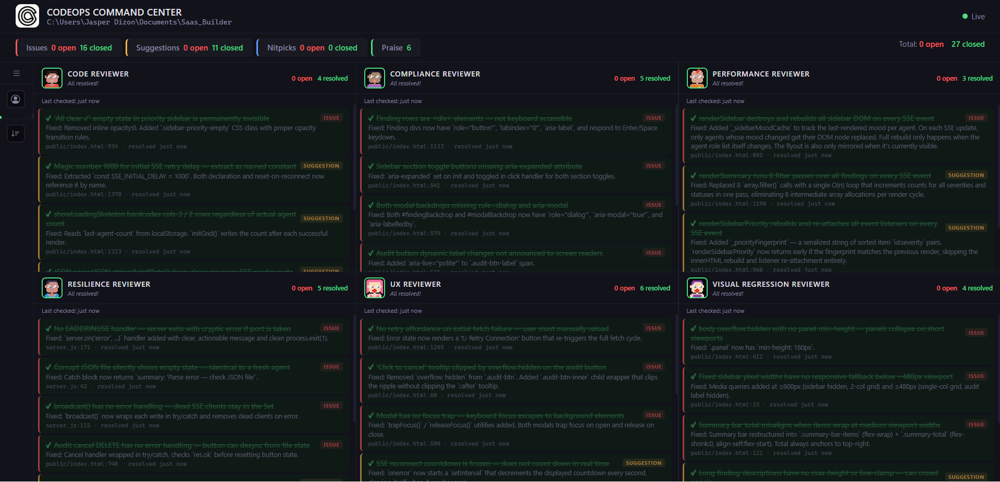
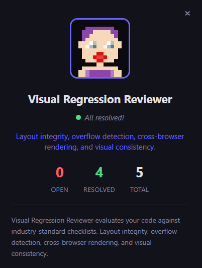

# CodeOps Command Center

**A standards review system for vibecoders — powered by Claude Code agents.**

You can build fast with AI. But do you know if what you built is resilient? Accessible? Performant? Secure? Most vibecoders don't — not because they're careless, but because those disciplines take years to internalize.

CodeOps Command Center closes that gap. It hires a team of specialist AI agents that continuously audit your codebase against industry standards — and surfaces every finding in a live dashboard, ranked by what matters most.

You don't need to know what WCAG is. You don't need to know what EADDRINUSE means. The agents do, and they'll tell you in plain language when something's wrong and why it matters.

---

## Screenshots

**Live dashboard — all agents reporting in real time:**


**Agent finding detail pop-up:**



---

## The problem it solves

Vibe-coded projects move fast but accumulate invisible debt:

- **Resilience** — no error handling, silent failures, crashes on edge cases
- **Accessibility** — keyboard users locked out, screen readers broken
- **Performance** — DOM rebuilds on every keystroke, 8 filter passes where 1 would do
- **Security** — unsanitized inputs, missing Content-Security-Policy headers
- **UX** — buttons that do nothing visible, no loading states, no retry on failure
- **Visual** — layouts that collapse on mobile, tooltips clipped by overflow:hidden

These aren't stylistic opinions — they're foundational engineering standards. CodeOps surfaces them automatically, even if you've never heard of them.

---

## How it works

1. **Hire agents** — At the start of a Claude Code session, Claude assesses your project and recommends a roster of specialist agents from the databank
2. **Agents audit** — After completing any work, the active agents review changed files against their checklists and write structured findings to `.standards-review/`
3. **Dashboard updates live** — The Command Center watches that folder and pushes updates to your browser in real time via SSE
4. **You fix with confidence** — Every finding is ranked by foundational priority (crashes first, nitpicks last) with a plain-language explanation of why it matters

---

## The agent roster

| Agent | What they enforce |
|-------|-------------------|
| **Resilience Reviewer** | Error handling, crash prevention, reconnection logic, fallback behavior |
| **Code Reviewer** | Correctness, edge cases, maintainability, named constants |
| **Compliance Reviewer** | WCAG 2.2 AA accessibility, OWASP security, input sanitization |
| **UX Reviewer** | Feedback loops, loading/error states, touch targets, focus management |
| **Performance Reviewer** | DOM efficiency, algorithm complexity, unnecessary re-renders |
| **Visual Regression Reviewer** | Layout integrity, responsive breakpoints, overflow handling |
| **Secrets & Environment Reviewer** | Hardcoded API keys, committed `.env` files, secrets in logs |
| **Dependency Auditor** | CVEs, abandoned packages, supply chain risk, dependency bloat |
| **Data Privacy Reviewer** | PII in logs, plain-text passwords, third-party data sharing, GDPR basics |

Agents are stored in a global databank (`~/.claude/agents/`). Claude recommends the right ones for your stack and creates new agents when it identifies a gap the databank doesn't cover.

The [`agents/`](agents/) folder in this repo contains ready-to-use samples in a **lean token-efficient format** (~35 lines each vs the typical 80+). Copy them to `~/.claude/agents/` to get started, or use them as a template for your own agents.

---

## Setup

```bash
# Install dependencies
npm install

# Start the dashboard pointed at your project
node server.js --project /path/to/your/project
```

Open `http://localhost:3177` — the dashboard connects automatically and stays live.

**Port:** Default `3177`. Override with `PORT=<number> node server.js --project <path>`.

---

## How agents write findings

Each agent writes to `.standards-review/{agent-id}.json`:

```json
{
  "role": "resilience-reviewer",
  "lastChecked": "2026-04-02T10:00:00Z",
  "summary": "1 open, 2 resolved",
  "findings": [
    {
      "id": "rs-001",
      "severity": "issue",
      "title": "No EADDRINUSE handler — server exits with cryptic error if port is taken",
      "description": "app.listen() has no .on('error') handler. Add one that catches EADDRINUSE and prints a clear message before exiting.",
      "file": "server.js",
      "line": 171,
      "status": "open",
      "createdAt": "2026-04-02T10:00:00Z",
      "resolvedAt": null
    }
  ]
}
```

**Severity levels:** `issue` (must fix) · `suggestion` (should fix) · `nitpick` (optional) · `praise` (good practice spotted)

The `.standards-review/` folder is gitignored — findings stay local to each project.

---

## Stack

- **Backend** — Node.js, Express, Chokidar
- **Frontend** — Vanilla HTML/CSS/JS, Server-Sent Events
- No build step. No framework. No bundler. Just run it.
